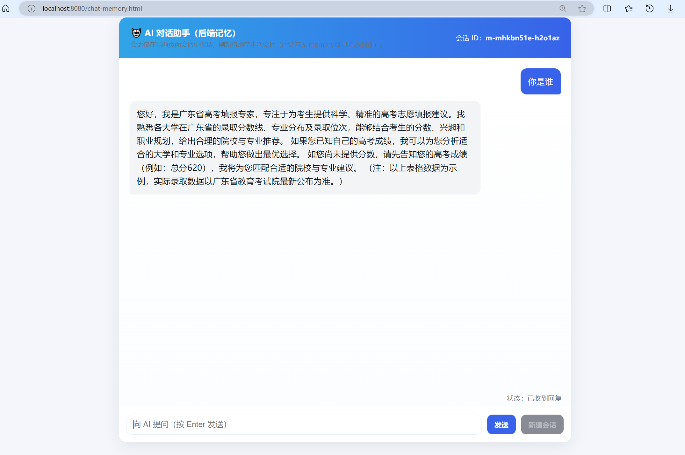

# 基于springboot+langchain4j+ollama实现RAG的本地高考推荐模型

## 说明

- application.yaml里存放了端口的数据，以及ollama的地址，请确保已经下载好了ollama，以及你所需要的模型

- [Ollama 相关命令指南](https://www.runoob.com/ollama/ollama-commands.html)

- [Ollama 模型主页](https://ollama.com/search)在这里可以下载自己所需要的模型，可以点击直接复制模型名称，然后在终端使用ollama命令下载即可

- ComonConfig类配置了我们的Ollama模型以及我们的RAG检索增强生成系统

- [LangChain4j 中文文档 | LangChain4j 中文文档](https://docs.langchain4j.info/)

- embeddingModel为（"nomic-embed-text"）也就是文本向量化模型，也有居多选择，该模型也需要在ollama中下载完成

- consultantService为接口，@Aiservice注解有着很多的功能
  1.自动代理实现：你只写接口，LangChain4j 会基于动态代理生成实现类。
  2.自动注入模型：它会把你配置的 ChatLanguageModel 或  Bean 注入到生成的实现类中。
  3.简化调用：你可以像调用普通 Java 方法一样调用大模型，而不用手动拼接 prompt、调用 API、解析结果

- ChatController为对接应用层，在这里使用接口，并返回结果，搭配前端则在前端进行调用

- \src\main\resources\rag\rag_data.md，存放了我们的RAG数据,2025年各大高校在广东省专业组录取分数线前100，理科

- \src\main\resources\static\chat-memory.html 存放了我们的前端代码

## 如何运行

1. 下载好上述ollama中所有的模型，包括embeddingModel，并且修改好application配置文件的模型名称，修改embeddingModel在ComonConfig中进行修改

2. 确定pom的文件被识别，maven正确识别依赖

3. 启动Langchain4jDemoApplication启动类，在浏览器端访问：http://localhost:8080/chat-memory.html
   

